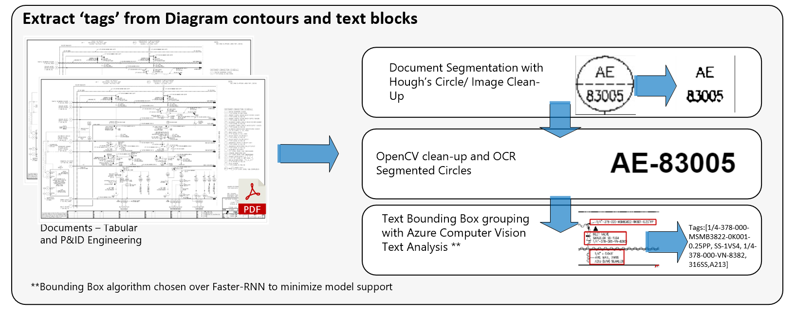
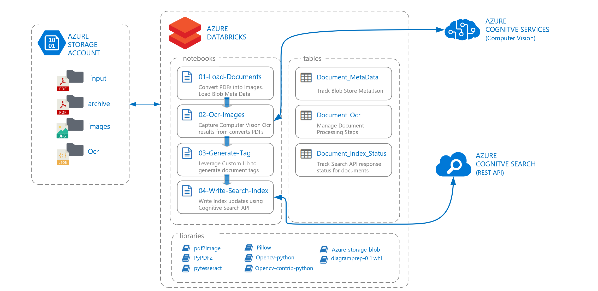

# Heuristics-based Text Extraction for Piping and Instrumentation Diagrams (PID)

This project was designed as part of a solution for processing PDF engineering
diagrams by segmenting instrument contours and text blocks to meet specific OCR
criteria. The conversion of PDFs to image files is done by Azure Databricks,
Azure Cognitive Service – Computer Vision is used to obtain OCR text blocks and
Azure Cognitive Search to query extracted diagram content.

## Python Wheel File – Diagram Prep

The Diagram Prep library primary objectives are 1. image clean-up and contour
matching for diagram tag retrieval and 2. OCR bounding box grouping to minimize
errors of left-to-right text reading of standard document OCR. The
ImageProcessor and TextProcessor align directly to the stated objectives above.

### Image Processor

The library’s ImageProcessor will extract text/tags from a diagram image using
opencv contour logic. The image can be either a byte string or opencv image.
Parameter tuning is required to optimize accuracy of heuristics-based approach.
Defaults are based on image size of ()

~~~~~~~~~~~~~~~~~~~~~~~~~~~~~~~~~~~~~~~~~~~~~~~~~~~~~~~~~~~~~~~~~~~~~~~~~~~~~~~~
from diagramprep.PidImage import PidImage 
from diagramprep.PidImageProcessor import PidImageProcessor
~~~~~~~~~~~~~~~~~~~~~~~~~~~~~~~~~~~~~~~~~~~~~~~~~~~~~~~~~~~~~~~~~~~~~~~~~~~~~~~~

### Text Processor

The library’s TextProcessor will group the JSON bounding boxes from Azure
Computer Vision based on horizontal alignment (right, left, center) and vertical
proximity – the sensitivity is adjustable.

### 

## Parameter Tuning

## Document Processing

